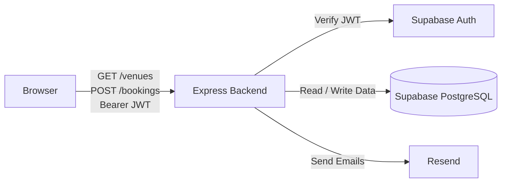
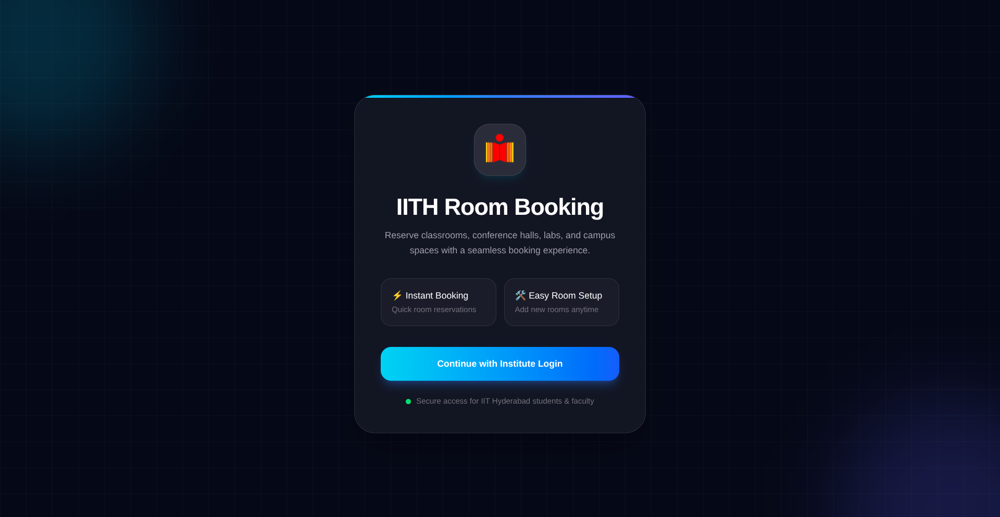
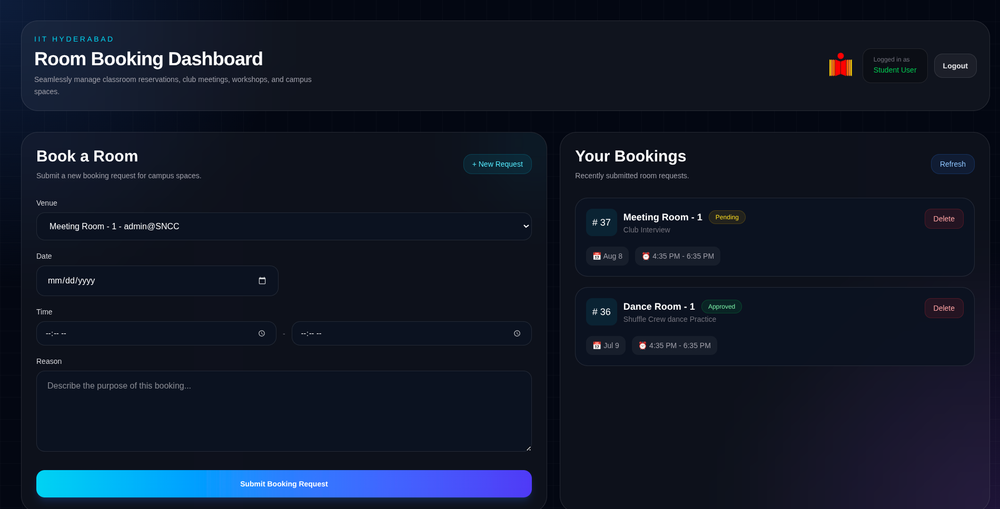
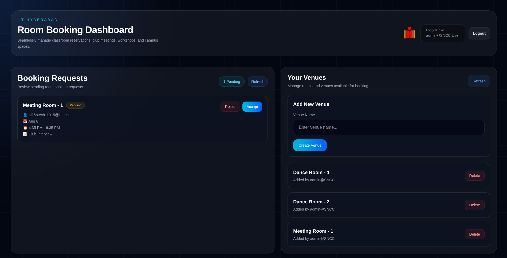

# IITH Campus Room Booking System

A **full-stack role-based** room reservation platform built for educational institutions. The system allows users to book campus rooms, prevents scheduling conflicts, supports Google authentication, and sends automated email notifications.

🔗 Live Demo: https://campus-room-booking-tawny.vercel.app

---

## Overview

Managing room reservations through spreadsheets or manual requests often results in scheduling conflicts and poor visibility.

This project provides a centralized booking platform where users can:

- Sign in using Google OAuth
- Request room reservations / admin Approve (or) Reject them 
- View booking status
- Receive email notifications
- Avoid overlapping bookings through automatic conflict detection
- Add/Delete Venues/Rooms as an admin 


---
## Tech Stack

### Frontend

<p>
  
</p>

### Backend

<p>
  
</p>

### Database & Authentication

<p>
  
  
</p>

### Services

<p>
  
</p>

Resend (Email Notifications)

---
## Key Features

### Authentication
- Google OAuth login
- Session management using Supabase Auth

### Booking Management
- Create booking requests
- View reservation status
- Booking history
- Accept / reject bookings (admin)

### Conflict Detection
- The backend automatically rejects overlapping bookings.

### Email Notifications
- Backend uses resend to send email when booking status changed
---

## Architecture

The application uses Supabase Authentication with Google OAuth and a stateless JWT-based backend.

1. Users sign in with Google through Supabase.
2. After successful authentication, Supabase issues a JWT to the browser.
3. The browser includes this JWT in API requests to the backend.
4. Backend middleware verifies the JWT using Supabase.
5. When email notifications are required, the backend uses Resend to send emails.
6. Application data is stored in PostgreSQL (via Supabase).

This architecture keeps authentication centralized in Supabase while the backend focuses on business logic and authorization.


## Screenshots

### Login




### Student Dashboard




### Admin Dashboard




---


## Local Setup

### 1.Clone the repo
```bash
git clone https://github.com/RithikBruh/Campus-Room-Booking.git
```

### 2.Install dependencies:

```bash
npm install
```
### 3.Configure Supabase and Google Oauth

### 4.Create Environment Variables

Frontend : 

```bash
room-booking-frontend/.env.local
```

```env
NEXT_PUBLIC_SUPABASE_URL=<YOUR_SUPABASE_URL>
NEXT_PUBLIC_SUPABASE_PUBLISHABLE_KEY=<YOUR_SUPABASE_PUBLISHABLE_KEY>
NEXT_PUBLIC_FRONTEND_URL=http://localhost:3001
NEXT_PUBLIC_BACKEND_URL=http://localhost:3000
```

Backend

```bash
room-booking-backend/.env
```


```env
DB_PSWD=<YOUR_DATABASE_PASSWORD>
DATABASE_URL=<YOUR_DATABASE_URL>

SUPABASE_URL=<YOUR_SUPABASE_URL>
SUPABASE_ANON_KEY=<YOUR_SUPABASE_ANON_KEY>

RESEND_API_KEY=<YOUR_RESEND_API_KEY>

PORT=3000
FRONTEND_URL=http://localhost:3001
```

### 5.Run
Run backend/frontend:
```
npm run dev
```

---


## Author

-Sai Rithik Mangipudi

-GitHub: https://github.com/RithikBruh